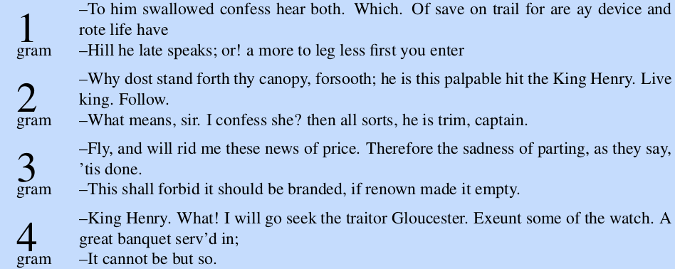
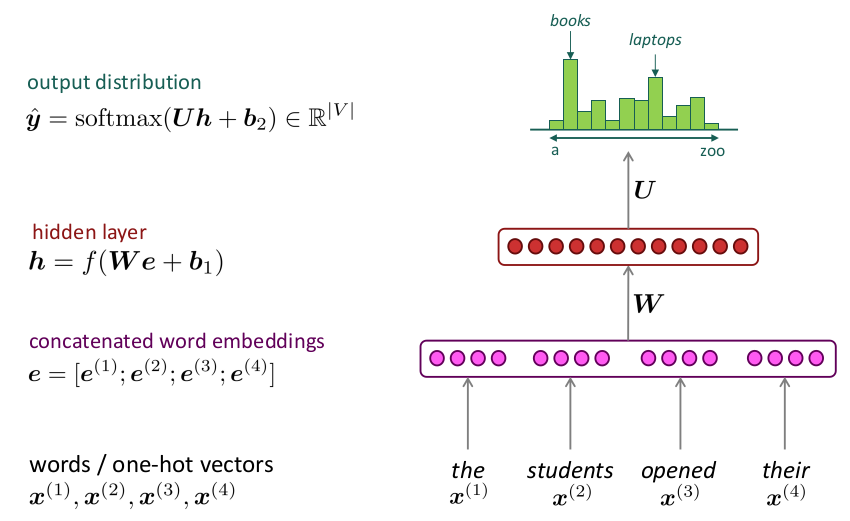
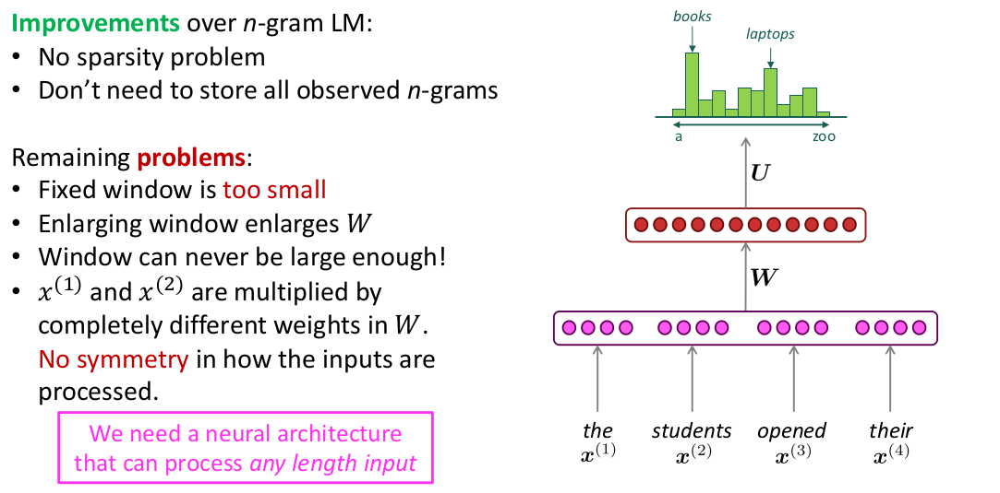

Language modelling with n-grams
===

Joan Serrat
``joans@cvc.uab.cat``

NLP course, 2022-23

---

References
===

*Speech and Language Processing* (3rd ed. draft) Dan Jurafsky, James H. Martin. https://web.stanford.edu/~jurafsky/slp3/.

- Chapter 3 : N-gram language models
- Appendix B : Spelling correction and the noisy channel
 

Reading:

*A Neural Probabilistic Language Model*. Yoshua Bengio et al. Journal of Machine Learning Research, No. 3 (2003) https://www.jmlr.org/papers/volume3/bengio03a/bengio03a.pdf

---

Outline
===

1. Language model : what is and why do we want it
1. $n$-grams for LM
1. Evaluation of LM : perplexity
1. Problems and solutions
    - sparsity, unknown words
    - smoothing and backoff
1. The first neural LM
1. An application of $n$-grams: word spelling

---

Plan
===

- Day 1, 2h : theory (these slides)
- Homework : prepare exercises
- Day 2, 2h : exercises, implement 
  - $n$-gram LM, 
  - simple bi-gram speller
  - neural LM

<!--
- *Why should I do the exercises ?*
  - then, no questions on this topic in the exam
  - exercises assessed *in situ*, attendance is compulsory
  - up to +1 point to be added to exam points
-->

---

Language model: what and why
===

A **language model** is an algorithm / method / formula to assign a **probability** to a sentence or to a sequence of words, in a given natural language.

$$P(\text{{\tt<s>Avui fa bon dia</s>}}) = 0.0123$$
$$P(\text{{\tt<s>How's the weather like today?</s>}}) = 0.0034$$

Also, the *conditional* probability of a certain word given one or more previous words

$$P(\text{{\tt temps}} ~|~ \text{{\tt Avui fa bon}}) = 0.3$$
$$P(\text{{\tt like}} ~|~ \text{{\tt How's the weather}}) = 0.8$$

which means also the most probable word in the vocabulary $V$ after a sequence

$$\underset{w \in V}{\argmax} \; P(w ~|~ \text{{\tt How's the weather}}) = \text{{\tt like}}$$

---

**Applications**

- Spell checking : 
  $$\ldots {\text{\tt How's the \red{wether} like}}\ldots \rightarrow \\ \underset{w \in V}{\argmax} \; P({\text{\tt How's the }}w{\text{\tt ~like}}) = {\text{\tt weather}}$$

  ${\ldots \text{\tt How's the like} \ldots}$

- Speech recognition, we want 
  $$P({\text{\tt recognize speech}}) > P({\text{\tt break a nice beach}})$$

---

- Machine translation :

   

  We want

  $$P(\text{\tt he briefed reporters on the main contents of the statement}) >  $$
  $$P(\text{\tt he introduced reporters to the main contents of the statement})$$

---

- Word prediction

  

   

  $\text{SortDescending}_{P(w \; | \; \text{\tt It's})}\;\{ w \in V \}, \; V \; \text{vocabulary}$

---

- Text generation : given a sequence of starting words $w_1 w_2 \ldots w_k$, 

  $$w_1 w_2 \ldots w_k \rightarrow w_1, w_2, \ldots w_k w_{k+1} \ldots w_n$$
  $$w_i = \argmax_{w \in V} P(w | w_{i-1}, w_{i-2} \ldots w_{i-k})\; , \; i=k+1 \ldots n, \text{or better} \\w_i = \text{Sample} \, \Big(w \sim P(w | w_{i-1}, w_{i-2} \ldots w_{i-k})\,\Big)$$

   

  $X \sim P(X)$ means aleatory variable $X$ follows distribution $P(X)$

---

## Goal

### Let $w_1, w_2 \ldots w_n$ be a sequence of words. How to compute or estimate $P(w_1, w_2 \ldots w_n)$ and $P(w_k | w_1 \ldots w_{k-1})$ ?

Naive solution:

1. take a large corpus
1. count occurrences of our sequence, $C(w_1, w_2 \ldots w_n)$
1. divide by total number of sequences of length $n$ in the corpus

**Problems**:
- maybe $w_1, w_2 \ldots w_n$ doesn't exist in the corpus, almost surely if $n$ large
- even if it exists, the corpus may not be large enough $\rightarrow$ probability not reliable

---

**Solution**: approximate

By the chain rule of probability
$$\begin{aligned}
  P(w_1, w_2 \ldots w_n) &= P(w_1) \, P(w_2 | w_1) \, P(w_3 | w_1, w_2) \, \ldots \, P(w_n | w_1 \ldots w_{n-1})\\ &= \prod_{k=1}^n P(w_k | w_1 \ldots w_{k-1})
  \end{aligned}
$$

Markov assumption: conditional probabilities depend only on the $N+1$ past words
$$P(w_k | w_1 \ldots w_{k-1}) = P(w_k | w_{k-1} \ldots w_{k-N+1})$$

If $N=2$, only previous word matters: 
$$P(w_1, w_2 \ldots w_n) = P(w_1)\,P(w_2|w_1)\,P(w_3|w_2) \ldots P(w_n | w_{n-1})$$

Do you think the approximation is reasonable ? Which is the best $N$ ?

---

$n$-grams
===

>*En una bella plana per on passava una bella aigua estaven gran res de besties selvatges qui volien elegir rei. Acord fo pres per la major part que el lleó fos rei. Més lo bou contrastava molt fortment a aquella elecció, i digué estes paraules*

Unigrams : ``En``, ``una``, ``bella``, ``plana`` ... ``paraules``

Bigrams : ``En una``, ``una bella``, ``bella plana`` ... ``digué estes``, ``estes paraules``

Trigrams : ``En una bella``, ``una bella plana``,  ... ``digué estes paraules``

An $n$-gram is a sequence of $n$ consecutive words. Their frequencies will be useful to compute the probabilities of a LM.

---

Now you can compute the conditional $\Rightarrow$ also the joint probability just by **counting $n$-grams**. For $N=2$, **bigrams**

$$\begin{aligned}
  P(w_k) &= \displaystyle\frac{C(w_k)}{S} \\
  P(w_k | w_{k-1}) &= \displaystyle\frac{C(w_{k-1} w_k)}{\sum_{w \in V} C(w_{k-1} w)} = \displaystyle\frac{C(w_{k-1} w_k)}{C(w_{k-1})} \\
  P(w_{k-1} w_k) &= P(w_k | w_{k-1}) P(w_{k-1})
  \end{aligned}
$$

$S$ is total number of words in the corpus.
$V$ set of *different* words in the corpus, or vocabulary

Why is this better ? It's much more probable than we can find all the $w_{k-1} w_k$ in the corpus than $w_1, \ldots w_n, n>2$.

 

Write the equations for $N=3$ and for the general case $N \geq 2$

---

### A technicality

We need to augment the vocabulary $V$ with special words 

``<s>`` = beginning of sentence
``</s>`` = end of sentence

Now we can make a bigram with the first word, and the set of all sentences has a proper probability distribution.

$$\begin{aligned}
&C(\text{{\tt En}} \;|\; \text{{\tt <s>}}) = 1 \\
&C(\text{{\tt </s>}} \;|\; \text{{\tt rei}}) = 2 \\
&P(\text{{\tt Acord}} \;|\; \text{{\tt <s>}}) = 1 \\
\end{aligned}
$$

Caution: $C(w)$ is *not* the number of unigrams = occurrences of $w$ but the number of times it's the first item of a bigram, including the two new words.

---

### Practical issues

- In practice it's better to use trigrams, 4-grams than bigrams. Why ?

- For trigrams you need to do like $P(\text{{\tt restaurant}} \,|\, \text{{\tt <s><s>}})$ = prob. ``restaurant`` is first word of a sentence, etc.

- Because of possibility of underflow (large $n$, large corpus), instead of

  $$P(w_1) \, P(w_2 | w_1) \, P(w_3 | w_1, w_2) \, \ldots \, P(w_n | w_1 \ldots w_{n-1})$$

  compute

  $$\exp\Big(\log P(w_1) + \log P(w_2 | w_1) + \log P(w_3 | w_1, w_2) + \ldots log P(w_n | w_1 \ldots w_{n-1})\Big)$$

 

Compute $P(\text{{\tt una bella}})$ from the text above

---

$n$-grams was one of the first takes of statistical NLP at building language models. 

- 1948 first mention of $n$-grams by [Claude Shannon]https://en.wikipedia.org/wiki/Claude_Shannon)
- 80s$-$ 00s $n$-grams, rule-based systems for NLP
- 90s$-$ recurrent NNs like [LSTM](https://en.wikipedia.org/wiki/Long_short-term_memory)
- 2003 Bengio et al. the first feed-forward neural LM
- 2010s **rise in computer power and data**
- 2012$-$ computer vision taken by storm by deep learning $\rightarrow$ NLP
- 2017$-$ attention models, transformer architectures which perform MUCH better

**Read [this ](https://devopedia.org/n-gram-model#milestones
) and [this ](https://towardsdatascience.com/evolution-of-language-models-n-grams-word-embeddings-attention-transformers-a688151825d2)**.

---

So, why study $n$-grams ?

- learn a *simple* approach
- pre-deep learning era 
- realize what were the problems that lead to *neural* LMs
- introduce LMs applications
- introduce the metric *perplexity* to assess LMs
- we'll compare in the exercise a simple version of the two approaches

---

Problems and solutions
===

1. Unknown words
1. The $n$ in $n$-grams and the ''zeros problem''

---

## Unknown words

- The training corpus may be large but at test time there may always be new words
- How to compute probabilities then ?
- Replace the less frequent words in the vocabulary by the ``UNK`` word
- any word not in the training vocabulary is ``UNK``
- estimate probabilities involving ``UNK`` considering it just like any other regular word

---

## The $n$

- the larger the context size $N$ the better the $n$-grams LM is : more coherent sentences are generated
- but in the same domain of training corpus (eg. English in Shakespeare $\neq$ English in Wall Street Journal)
- Shakespeare complete works corpus: 884,647 words, vocabulary 29,066 words

---

  
credits: Juravsky

---

The problem of large $N$ is 

- ratio of actual vs possible $n$-grams tends to 0 : $3e5$ found 4-grams vs $V^4 = 7e17$ possible 4-grams
- *It can not be but* $\rightarrow$  *that* | *I* | *he* | *thou* | *so*
- for most 4-grams there is only 1 continuation possible
- generated text is *literally* Shakespeare

Probabilities are not or less reliable : the zeros problem.

---
Recall : the idea of LM with $n$-grams is to compute probabilities just by **counting**. For $n=2$, bigrams

$$\begin{aligned}
  P(w_k | w_{k-1}) &= \displaystyle\frac{C(w_{k-1} w_k)}{\sum_{w \in V} C(w_{k-1} w)} = \displaystyle\frac{C(w_{k-1} w_k)}{C(w_{k-1})} \\
  P(w_{k-1} w_k) &= P(w_k | w_{k-1}) P(w_{k-1}) \\
  P(w_k) &= \displaystyle\frac{C(w_k)}{S}
  \end{aligned}
$$

Probability computations suffer the **zeros problem**: 
$$P({\text{\tt can not be but simple}}) = 0$$ 

in spite ${\tt simple}$ appears in (maybe many) other 5-grams

---

## Smoothing

Q: What to do with words in the vocabulary (not unknown) but appear in the test set in an unseen context ?

$$P({\tt simple} \, | \, {\text{\tt can not be but}}) = 0$$

A: discount a bit of probability from frequent $n$-grams and give it to them

---

#### *add one* or Laplace smoothing

 

$$P(w_k | w_{k-1}) = \displaystyle\frac{C(w_{k-1} w_k)}{C(w_{k-1})} \longrightarrow \displaystyle\frac{C(w_{k-1} w_k) + 1}{C(w_{k-1}) + |V|}$$

$$|V| \; \text{size of the vocabulary}$$

---

#### Backoff

Alternatively, if we want $P(w_k | w_{k-2}, w_{k-1})$ and there are no trigrams $w_{k-2} w_{k-1} w_k$, resort to $P(w_k | w_{k-1})$.

If there are not bigrams $w_{k-1} w_k$, resort to $P(w_k)$

$P(w_k) > 0$ because $w_k$ is a known word or ``<UNK>``

---

#### Stupid backoff

Little problem with backoff : the algorithm does not provide a proper probability distribution because there's no discount.

"Solution" : stupid backoff

$$S(w_k | w_{k-N+1} \ldots w_{k-1}) = \left\{
\begin{array}{l}
\displaystyle\frac{C(w_{k-N+1} \ldots w_{k-1}w_k)}{C(w_{k-N+1} \ldots w_{k-1})} \, \text{if numerator} > 0\\
\\
\lambda \; S(w_k | w_{k-N+1} \ldots w_{k-2}) \; \text{else}
\end{array}\right.
$$

$S$ and not $P$ because again does not produce a probability distribution, but works better in practice (2007) for $\lambda=0.4$ in large corpora.

---

Evaluation of LM : perplexity
===

---

Feed forward neural LM
===

---

---

Spell checking
===

---

Exercise 1 : Sample a $n$-gram LM
===

1. Download a corpus in Catalan, Spanish or English
1. Process to extract tokens, sentences
2. Create a LM from its bigrams, trigrams, 4-grams
3. Sample the LM to generate text

[NLTK](https://www.nltk.org) has support for this and is well [documented](https://www.nltk.org/book/).

---

Exercise 2
===

Compare a $n$-grams LM with the feed-forward LM
1. Load the ``cess_cat`` corpus, already tokenized and segmented in sentences.
1. Add ``<s>``, ``</s>``
1. Make a Pytorch ``Dataset`` that returns batches of $n$-grams
1. Build the FF neural network (code provided)
1. Train it (GPU in Google Colab)
1. Generate text and compare
1. Optionally, visualize the learned word embedding

---

Exercise 3
===

Build a spell corrector based on a LM. For the sake of simplicity we'll only consider the *real word* part. 

The goal is, given a text, suggest a *ranked* list of words for each potentially mispelled word that still is a real word:

$$\text{\tt{Dear, I wish you \red{where} here}}$$

To rank the list of real words close to the misspelled one, use the probabilities of the $n$-gram and / or neural LM. Bayes inference.
