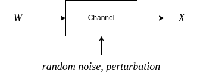

Language modelling with n-grams
===


Joan Serrat
``joans@cvc.uab.cat``

NLP course, 2022-23

---

References
===

*Speech and Language Processing* (3rd ed. draft) Dan Jurafsky, James H. Martin. https://web.stanford.edu/~jurafsky/slp3/.

- Chapter 3 : N-gram language models
- Appendix B : Spelling correction and the noisy channel
 

Reading:

*A Neural Probabilistic Language Model*. Yoshua Bengio et al. Journal of Machine Learning Research, No. 3 (2003) https://www.jmlr.org/papers/volume3/bengio03a/bengio03a.pdf

---

Outline
===

1. Language model : what is and why do we want it
1. $n$-grams for LM
1. Evaluation of LM : perplexity
1. Problems and solutions
    - sparsity, unknown words
    - smoothing and backoff
1. The first neural LM
1. An application of $n$-grams: word spelling

---

Plan
===

- Day 1, 2h : theory (these slides)
- Homework : prepare exercises
- Day 2, 2h : exercises, implement 
  - $n$-gram LM, 
  - simple bi-gram speller
  - neural LM

<!--
- *Why should I do the exercises ?*
  - then, no questions on this topic in the exam
  - exercises assessed *in situ*, attendance is compulsory
  - up to +1 point to be added to exam points
-->

---

Language model: what and why
===

A **language model** is an algorithm / method / formula to assign a **probability** to a sentence or to a sequence of words, in a given natural language.

$$P(\text{{\tt<s>Avui fa bon dia</s>}}) = 0.0123$$
$$P(\text{{\tt<s>How's the weather like today?</s>}}) = 0.0034$$

Also, the *conditional* probability of a certain word given one or more previous words

$$P(\text{{\tt temps}} ~|~ \text{{\tt Avui fa bon}}) = 0.3$$
$$P(\text{{\tt like}} ~|~ \text{{\tt How's the weather}}) = 0.8$$

which means also the most probable word in the vocabulary $V$ after a sequence

$$\underset{w \in V}{\argmax} \; P(w ~|~ \text{{\tt How's the weather}}) = \text{{\tt like}}$$

---

**Applications**

- Spell checking : 
  $$\ldots {\text{\tt How's the \red{wether} like}}\ldots \rightarrow \\ \underset{w \in V}{\argmax} \; P({\text{\tt How's the }}w{\text{\tt ~like}}) = {\text{\tt weather}}$$

  ${\ldots \text{\tt How's the like} \ldots}$

- Speech recognition, we want 
  $$P({\text{\tt recognize speech}}) > P({\text{\tt break a nice beach}})$$

---

- Machine translation :

   

  We want

  $$P(\text{\tt he briefed reporters on the main contents of the statement}) >  $$
  $$P(\text{\tt he introduced reporters to the main contents of the statement})$$


---

- Word prediction

  

  <br>

  $\text{SortDescending}_{P(w \; | \; \text{\tt It's})}\;\{ w \in V \}, \; V \; \text{vocabulary}$

---

- Text generation : given a sequence of starting words $w_1 w_2 \ldots w_k$, 

  $$w_1 w_2 \ldots w_k \rightarrow w_1, w_2, \ldots w_k w_{k+1} \ldots w_n$$
  $$w_i = \argmax_{w \in V} P(w | w_{i-1}, w_{i-2} \ldots w_{i-k})\; , \; i=k+1 \ldots n, \text{or better} \\w_i = \text{Sample} \, \Big(w \sim P(w | w_{i-1}, w_{i-2} \ldots w_{i-k})\,\Big)$$

  <br>

  $X \sim P(X)$ means aleatory variable $X$ follows distribution $P(X)$

---

## Goal

### Let $w_1, w_2 \ldots w_n$ be a sequence of words. How to compute or estimate $P(w_1, w_2 \ldots w_n)$ and $P(w_k | w_1 \ldots w_{k-1})$ ?

Naive solution:

1. take a large corpus
1. count occurrences of our sequence, $C(w_1, w_2 \ldots w_n)$
1. divide by total number of sequences of length $n$ in the corpus

**Problems**:
- maybe $w_1, w_2 \ldots w_n$ doesn't exist in the corpus, almost surely if $n$ large
- even if it exists, the corpus may not be large enough $\rightarrow$ probability not reliable

---

**Solution**: approximate

By the chain rule of probability
$$\begin{aligned}
  P(w_1, w_2 \ldots w_n) &= P(w_1) \, P(w_2 | w_1) \, P(w_3 | w_1, w_2) \, \ldots \, P(w_n | w_1 \ldots w_{n-1})\\ &= \prod_{k=1}^n P(w_k | w_1 \ldots w_{k-1})
  \end{aligned}
$$

Markov assumption: conditional probabilities depend only on the $N+1$ past words
$$P(w_k | w_1 \ldots w_{k-1}) = P(w_k | w_{k-1} \ldots w_{k-N+1})$$

If $N=2$, only previous word matters: 
$$P(w_1, w_2 \ldots w_n) = P(w_1)\,P(w_2|w_1)\,P(w_3|w_2) \ldots P(w_n | w_{n-1})$$


<span style="color:blue">Do you think the approximation is reasonable ? Which is the best $N$ ?</span>

---


$n$-grams
===

>*En una bella plana per on passava una bella aigua estaven gran res de besties selvatges qui volien elegir rei. Acord fo pres per la major part que el lleó fos rei. Més lo bou contrastava molt fortment a aquella elecció, i digué estes paraules*

Unigrams : ``En``, ``una``, ``bella``, ``plana`` ... ``paraules``

Bigrams : ``En una``, ``una bella``, ``bella plana`` ... ``digué estes``, ``estes paraules``

Trigrams : ``En una bella``, ``una bella plana``,  ... ``digué estes paraules``


An $n$-gram is a sequence of $n$ consecutive words. Their frequencies will be useful to compute the probabilities of a LM.

---

Now you can compute the conditional $\Rightarrow$ also the joint probability just by **counting $n$-grams**. For $N=2$, **bigrams**

$$\begin{aligned}
  P(w_k) &= \displaystyle\frac{C(w_k)}{S} \\
  P(w_k | w_{k-1}) &= \displaystyle\frac{C(w_{k-1} w_k)}{\sum_{w \in V} C(w_{k-1} w)} = \displaystyle\frac{C(w_{k-1} w_k)}{C(w_{k-1})} \\
  P(w_{k-1} w_k) &= P(w_k | w_{k-1}) P(w_{k-1})
  \end{aligned}
$$

$S$ is total number of words in the corpus.
$V$ set of *different* words in the corpus, or vocabulary

Why is this better ? It's much more probable than we can find all the $w_{k-1} w_k$ in the corpus than $w_1, \ldots w_n, n>2$.

<br>

<span style="color:blue">Write the equations for $N=3$ and for the general case $N \geq 2$</span>

---

### A technicality

We need to augment the vocabulary $V$ with special words 

``<s>`` = beginning of sentence
``</s>`` = end of sentence

Now we can make a bigram with the first word, and the set of all sentences has a proper probability distribution.

$$\begin{aligned}
&C(\text{{\tt En}} \;|\; \text{{\tt <s>}}) = 1 \\
&C(\text{{\tt </s>}} \;|\; \text{{\tt rei}}) = 2 \\
&P(\text{{\tt Acord}} \;|\; \text{{\tt <s>}}) = 1 \\
\end{aligned}
$$

Caution: $C(w)$ is *not* the number of unigrams = occurrences of $w$ but the number of times it's the first item of a bigram, including the two new words.

---

### Practical issues

- In practice it's better to use trigrams, 4-grams than bigrams. <span style="color:blue">Why ?</span>

- For trigrams you need to do like $P(\text{{\tt restaurant}} \,|\, \text{{\tt <s><s>}})$ = prob. ``restaurant`` is first word of a sentence, etc.

- Because of possibility of underflow (large $n$, large corpus), instead of

  $$P(w_1) \, P(w_2 | w_1) \, P(w_3 | w_1, w_2) \, \ldots \, P(w_n | w_1 \ldots w_{n-1})$$

  compute

  $$\exp\Big(\log P(w_1) + \log P(w_2 | w_1) + \log P(w_3 | w_1, w_2) + \ldots log P(w_n | w_1 \ldots w_{n-1})\Big)$$

<br>

<span style="color:blue">Compute $P(\text{{\tt una bella}})$ from the text above</span>

---

$n$-grams was one of the first takes of statistical NLP at building language models. 

- 1948 first mention of $n$-grams by [Claude Shannon]https://en.wikipedia.org/wiki/Claude_Shannon)
- 80s$-$ 00s $n$-grams, rule-based systems for NLP
- 90s$-$ recurrent NNs like [LSTM](https://en.wikipedia.org/wiki/Long_short-term_memory)
- 2003 Bengio et al. the first feed-forward neural LM
- 2010s **rise in computer power and data**
- 2012$-$ computer vision taken by storm by deep learning $\rightarrow$ NLP
- 2017$-$ attention models, transformer architectures which perform MUCH better

**Read [this ](https://devopedia.org/n-gram-model#milestones
) and [this ](https://towardsdatascience.com/evolution-of-language-models-n-grams-word-embeddings-attention-transformers-a688151825d2)**.

---

So, why study $n$-grams ?

- learn a *simple* approach
- pre-deep learning era 
- realize what were the problems that lead to *neural* LMs
- introduce LMs applications
- introduce the metric *perplexity* to assess LMs
- we'll compare in the exercise a simple version of the two approaches

---

Problems and solutions
===

1. Unknown words
1. The $n$ in $n$-grams and the ''zeros problem''

---

## Unknown words

- The training corpus may be large but at test time there may always be new words
- How to compute probabilities then ?
- Replace the less frequent words in the vocabulary by the ``UNK`` word
- any word not in the training vocabulary is ``UNK``
- estimate probabilities involving ``UNK`` considering it just like any other regular word

---

## The $n$

- the larger the context size $N$ the better the $n$-grams LM is : more coherent sentences are generated
- but in the same domain of training corpus (eg. English in Shakespeare $\neq$ English in Wall Street Journal)
- Shakespeare complete works corpus: 884,647 words, vocabulary 29,066 words

---


<br><br>
credits: Juravsky

---

The problem of large $N$ is 

- ratio of actual vs possible $n$-grams tends to 0 : $3e5$ found 4-grams vs $V^4 = 7e17$ possible 4-grams
- *It can not be but* $\rightarrow$  *that* | *I* | *he* | *thou* | *so*
- for most 4-grams there is only 1 continuation possible
- generated text is *literally* Shakespeare

Probabilities are not or less reliable : the zeros problem.

---
Recall : the idea of LM with $n$-grams is to compute probabilities just by **counting**. For $n=2$, bigrams

$$\begin{aligned}
  P(w_k | w_{k-1}) &= \displaystyle\frac{C(w_{k-1} w_k)}{\sum_{w \in V} C(w_{k-1} w)} = \displaystyle\frac{C(w_{k-1} w_k)}{C(w_{k-1})} \\
  P(w_{k-1} w_k) &= P(w_k | w_{k-1}) P(w_{k-1}) \\
  P(w_k) &= \displaystyle\frac{C(w_k)}{S}
  \end{aligned}
$$

Probability computations suffer the **zeros problem**: 
$$P({\text{\tt can not be but simple}}) = 0$$ 

in spite ${\tt simple}$ appears in (maybe many) other 5-grams

---

## Smoothing

Q: What to do with words in the vocabulary (not unknown) but appear in the test set in an unseen context ?

$$P({\tt simple} \, | \, {\text{\tt can not be but}}) = 0$$


A: discount a bit of probability from frequent $n$-grams and give it to them

---

#### *add one* or Laplace smoothing

<br>

$$P(w_k | w_{k-1}) = \displaystyle\frac{C(w_{k-1} w_k)}{C(w_{k-1})} \longrightarrow \displaystyle\frac{C(w_{k-1} w_k) + 1}{C(w_{k-1}) + |V|}$$

$$|V| \; \text{size of the vocabulary}$$


---

#### Backoff

Alternatively, if we want $P(w_k | w_{k-2}, w_{k-1})$ and there are no trigrams $w_{k-2} w_{k-1} w_k$, resort to $P(w_k | w_{k-1})$.

If there are not bigrams $w_{k-1} w_k$, resort to $P(w_k)$

$P(w_k) > 0$ because $w_k$ is a known word or ``<UNK>``

---

#### Stupid backoff

Little problem with backoff : the algorithm does not provide a proper probability distribution because there's no discount.

"Solution" : stupid backoff

$$S(w_k | w_{k-N+1} \ldots w_{k-1}) = \left\{
\begin{array}{l}
\displaystyle\frac{C(w_{k-N+1} \ldots w_{k-1}w_k)}{C(w_{k-N+1} \ldots w_{k-1})} \, \text{if numerator} > 0\\
\\
\lambda \; S(w_k | w_{k-N+1} \ldots w_{k-2}) \; \text{else}
\end{array}\right.
$$

$S$ and not $P$ because again does not produce a probability distribution, but works better in practice (2007) for $\lambda=0.4$ in large corpora.

---

Evaluation of LM : perplexity
===

TODO: no em sembla interessant ni aplicable, al final es una formula

---

Feed forward neural LM
===

TODO: acabar-ho


---


---

Spell checking
===


Frequency of spelling errors vary 
- from 1-2% for carefully retyping already printed text 
- to 10-15% for web queries.

---

## Two types

- **Non-word spelling correction** : errors that result in non-words, not in the vocabulary

  >Emma Woodhouse, <font color="red">hansome</font>, clever, and rich, with a <font color="red">confortable</font> home and happy disposition, seemed to unite some of the best <font color="red">blesings</font> of existence; and had lived nearly twenty-one years in the world with very little to <font color="red">distres</font> or vex her. 
  **Emma, Jane Austin**

---

<font color="red"></font>

- **Real word spelling correction** : spelling errors even if they accidentally result in an actual word

  >Emma Woodhouse, <font color="red">hand some</font>, clever, and rich, with a comfortable home <font color="red">an</font> happy disposition, seemed to <font color="red">unit</font> some of the best blessings of existence; and <font color="red">hat</font> lived nearly twenty-one years in the world with very little <font color="red">too</font> distress or vex her. 
  **Emma, Jane Austin**

---

Strategy for non-word errors:

- find words $w_1 \ldots w_n$ not in the vocabulary
- for each $w_i$ 
  - find the words in the vocabulary at a Levenshtein$^1$ distance $\leq 1$ 
  - **rank** these words by decreasing **probability of being the correct one**
  - show the list and let the user choose

<br>

$^1$ delete, add, replace 1 character, transpose 2 successive characters. $\tt{where} \rightarrow$ $\tt{were}, \tt{there}, \tt{here}, \tt{wheer}$ 

---

Strategy for real-word errors:

- more difficult because *any* word can be an error
- for each typed *sentence* $X$
  - assume there is 0 or only 1 misspelled word
  - for each of its words find words in the vocabulary at distance $\leq 1$
  - make all possible sentences in this way, $C(X)$
  - rank these sentences by decreasing **probability of being the correct one**
  - select $W \in C(X)$ such that $P(W | X) - P(X | X) \geq \text{\tt{threshold}}$
  - show list and let the user choose

---

$X$ = *I wish you where here*

$W \in C(X)$ and (posterior) probabilities :

```text
I	wish	you	where	here 	8.924506647995294e-12 
A	wish	you	where	here 	1.0286322789468195e-17 
a	wish	you	where	here 	1.4812615001448439e-18 
s	wish	you	where	here 	2.547891284427092e-18 
If	wish	you	where	here 	8.184815983017701e-18 
It	wish	you	where	here 	3.262865831067868e-17 
I	fish	you	where	here 	7.454921980723136e-20 
I	with	you	where	here 	3.594682695244262e-16 
I	wish	You	where	here 	3.392605965931279e-17 
I	wish	your	where	here 	4.715633943530782e-15 
I	wish	you	here	here 	3.8867450475411456e-14 
I	wish	you	were	here 	1.903874150218112e-09 *******
I	wish	you	There	here 	3.769850459645172e-14 
I	wish	you	Where	here 	4.675783515838973e-15 
I	wish	you	there	here 	2.818265257261675e-13 
I	wish	you	where	her 	1.2012691689115732e-12 
I	wish	you	where	hers 	1.0090459209673022e-14 
I	wish	you	where	were 	2.9817306964583775e-13 
I	wish	you	where	There 	6.508346190239099e-14 
I	wish	you	where	Where 	8.072367367738417e-15 
I	wish	you	where	there 	7.661465393231837e-12 
I	wish	you	where	where 	3.582113019433922e-14
```

---

How to compute the probabilities ? Using the **noisy-channel model** (at sentence level)



$X = x_1x_2\ldots x_n$ typed sentence (correct or no)
$C(X)$ set of candidate sentences to correct sentence $= X$ plus sentences with 1 word changed to another real-word at Levenshtein distance 1 
$W = w_1w_2\ldots w_n$ correct sentence

<br>

$$ \text{\bf Goal :} \;\;\; \hat W = \displaystyle\argmax_{W \; \in \; C(X)} \; P(W | X)$$

---

We can not compute / model $P(W | X)$ but by Bayes theorem

<br>

$$P(W | X) = \displaystyle\frac{P(X | W) P(W)}{P(X)}$$

$$\hat W = \argmax_{W \; \in \; C(X)} \; P(W | X) = \argmax_{W \; \in \; C(X)} \; P(X | W) P(W)$$

<br>

- $P(X|W)$ likelihood, **channel model**, 
  how probable is that $W$ is transformed into $X$
- $P(W)$ prior
- $P(X)$ evidence, doesn't matter because we optimize with respect to $W$

---

How to compute $P(W)$ ? Using a $n$-gram language model

- $W$ is a sentence 
- append $(n-1)$ $\text{\tt <s>}$ at the begining and one $\text{\tt </s>}$ at the end
- $W = w_1w_2\ldots w_k$
- by the Markovianity assumption 
    - bigrams $P(w_1, w_2 \ldots w_k) = P(w_2|w_1)\,P(w_3|w_2) \ldots P(w_k | w_{k-1})$
    - trigrams $P(w_1, w_2 \ldots w_k) = P(w_3|w_1w_2) \ldots P(w_k | w_{k-2}w_{k-1})$
    - ...

But a neural language model would do also, if the output is passed to a softmax layer.

---

How to compute $P(X | W)$ ?

- $X$ sentence $x_1x_2\ldots x_k$ with same number of words than $W = w_1w_2\ldots w_k$
- $W$ is each sentence in $C(X)$
- $P(X | W) = \displaystyle\prod_{i=1}^k p(x_i | w_i)$
- $C(x)$ set of words in the vocabulary at a distance $\leq 1$ of $x$, thus including $x$ itself
- A simplification : the probability of writing $x_i$ instead of $w_i, \; i=1\ldots k$ is
$$p(x | w) = \left\{ 
  \begin{array}{l}
  \alpha \;\;\; \text{if} \;\; w = x, \; \text{for instance} \;\; 0.95 \\
  \\
  \displaystyle\frac{1 - \alpha}{|C(x)| - 1}\;\;\; \text{if} \;\; \red{w} \in C(x) \;\;\text{but}\; x \neq w \\
  \\
  0 \;\;\; \text{else}
  \end{array} \right.
$$

---

Exercise 1 : Sample a $n$-gram LM
===

1. Download a corpus in Catalan, Spanish or English
1. Process to extract tokens, sentences
2. Create a LM from its bigrams, trigrams, 4-grams
3. Sample the LM to generate text

[NLTK](https://www.nltk.org) has support for this and is well [documented](https://www.nltk.org/book/).

Link to [Google Colab notebook](https://colab.research.google.com/drive/17U8E4HRDA7g3bMwe2SMuy9GjxUO4sgGh?usp=sharing)

---

Exercise 2
===

Compare a $n$-grams LM with the feed-forward LM
1. Load the ``cess_cat`` corpus, already tokenized and segmented in sentences.
1. Add ``<s>``, ``</s>``
1. Make a Pytorch ``Dataset`` that returns batches of $n$-grams
1. Build the FF neural network (code provided)
1. Train it (GPU in Google Colab)
1. Generate text and compare
1. Optionally, visualize the learned word embedding

Link to [Google Colab notebook](https://colab.research.google.com/drive/1skhaGGMb0HX60Nvv4q-D5lAyxcayEqaU?usp=sharing)

---

Exercise 3
===

Build a spell corrector based on a LM. For the sake of simplicity we'll only consider the *real word* part. 

The goal is, given a text, suggest a *ranked* list of words for each potentially mispelled word that still is a real word:

$$\text{\tt{I wish you \red{where} here}}$$

To rank the list of real words close to the misspelled one, use the probabilities of the $n$-gram and / or neural LM and Bayes.

Link to [Google Colab notebook](https://colab.research.google.com/drive/1QJDZrt-kAy5mDA24pa7BH1-_W2_yclpv?usp=sharing)